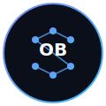

<div align="center">



<br/>

<a href="https://git.io/typing-svg">
  
</a>

<br/><br/>


<br/>

[](https://github.com/Ombankar1111-gi)
[](https://www.linkedin.com/in/om-bankar-811798302)
[](https://leetcode.com/u/ombankar_0007/)
[](mailto:ombankar1111@gmail.com)

<br/>

🟢 **Open to work** — AI Engineer · GenAI Engineer · LLM Engineer · Machine Learning roles

</div>

<br/>

## 👋 About Me

I'm a third-year **B.E. student in Artificial Intelligence & Data Science** at SNJB's Late Sau. K.B.J. College of Engineering, Chandwad, Nashik (CGPA **8.90/10**). I build **Generative AI and LLM-powered applications** using Retrieval-Augmented Generation (RAG) pipelines, LangChain, FAISS, HuggingFace, and Groq LLMs — and I recently completed an internship where I shipped these kinds of systems end-to-end.

- 🔭 **Currently building:** RAG-based AI applications and LLM pipelines (data ingestion → embeddings → retrieval → generation → deployment)
- 🌱 **Currently learning:** Data Structures & Algorithms, and going deeper into agentic AI workflows
- 🧠 **Areas of interest:** Generative AI · Large Language Models · Machine Learning · NLP · AI Engineering
- 🎓 **Education:** B.E. in AI & Data Science, 2023 – 2027
- 💼 **Past internship:** LLM Developer Intern @ LazyDeveloper TechEd Pvt. Ltd. (Aug – Dec 2025)
- ⚡ **Fun fact:** I've deployed a live RAG chatbot that can answer questions straight out of any PDF you throw at it

<br/>

## 🛠️ Tech Stack

**Languages**


**AI · Machine Learning · Generative AI**


**Generative AI / LLM Frameworks**


**Frameworks & Tools**


**Libraries**


<br/>

## 📊 GitHub Stats

<div align="center">


<br/>


<br/>


</div>

> 🐍 Live contribution snake and 📈 metrics card auto-update daily via GitHub Actions — see `/assets` once the workflows run.

<br/>

## 🚀 Featured Projects

<table>
<tr>
<td width="50%" valign="top">

### 🤖 AI PDF Chatbot (RAG Architecture)

An AI-powered chatbot that answers questions from uploaded PDF documents in real time using a full Retrieval-Augmented Generation pipeline.

**Highlights**
- PDF text extraction → chunking → embedding pipeline
- FAISS vector database for similarity search over document embeddings
- Groq LLM integrated via LangChain for context-aware answers
- Deployed live on Streamlit Cloud

**Tech:** `Python` `LangChain` `FAISS` `HuggingFace Embeddings` `Groq LLM` `Streamlit`

[](https://github.com/Ombankar1111-gi/ai-pdf-chatbot-rag)
[](https://ai-pdf-chatbot-rag-w2tmc2qdjbxlfwktvcmqre.streamlit.app/)

</td>
<td width="50%" valign="top">

### 🧩 DSA Journey With Python

A curated, growing repository of Data Structures & Algorithms solutions in Python — focused on problem-solving, optimization, and interview preparation.

**Highlights**
- Organized by topic: Arrays, Hash Tables, Math, Two Pointers, Strings
- Clean, well-commented solutions
- Ongoing DSA practice log

**Tech:** `Python` `Data Structures` `Algorithms`

[](https://github.com/Ombankar1111-gi/DSA-Journey-With-Python)

</td>
</tr>
</table>

<br/>

## 💼 Experience

```
Aug 2025 ─┬─ LLM Developer Intern — LazyDeveloper TechEd Pvt. Ltd.
          │  • Built LLM-powered applications and AI-driven workflows for real-world use cases
          │  • Designed RAG pipelines using LangChain and vector databases
          │  • Integrated HuggingFace models and Groq LLM APIs into production AI systems
          │  • Improved response quality through prompt engineering and evaluation
Dec 2025 ─┴─ Participated in development, testing, debugging & optimization of AI applications
```

<br/>

## 🏆 Certifications

| Certification | Issuer |
|---|---|
| 🎖️ Salesforce Agentforce Specialist | Salesforce Trailhead |
| 🎖️ GenAI Powered Data Analytics Job Simulation | Tata Group (via Forage) |
| 🎖️ Machine Learning Using Python | Simplilearn SkillUp |

<br/>

## 🎓 Leadership & Activities

- Elected **Student Member Representative** through a college-wide student election
- Served as **Student Member** of the AI & DS Department Community
- Active learner and contributor across AI, ML, Generative AI, and software development initiatives

<br/>

## 📫 Connect With Me

<div align="center">

[](https://github.com/Ombankar1111-gi)
[](https://www.linkedin.com/in/om-bankar-811798302)
[](https://leetcode.com/u/ombankar_0007/)
[](mailto:ombankar1111@gmail.com)

<br/>


</div>

<br/>

<div align="center">

<br/>
<sub>Thanks for stopping by — always happy to talk AI, LLMs, and RAG systems 🤝</sub>
</div>
