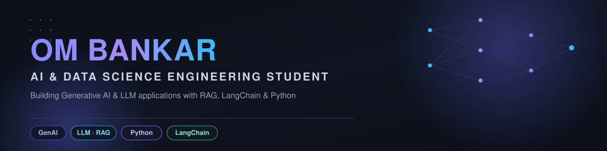

<div align="center">



<br/>

<a href="https://git.io/typing-svg">
  
</a>

<br/><br/>


<br/>

[](https://github.com/Ombankar1111-gi)
[](https://www.linkedin.com/in/om-bankar-811798302/)
[](https://leetcode.com/u/ombankar_0007/)
[](mailto:ombankar1111@gmail.com)

<br/>

🟢 **Open to work** — AI Engineer · Machine Learning Engineer · Generative AI Engineer · LLM Engineer · Python / Software Engineer

</div>

<br/>

## 👋 About Me

I'm a **final-year B.E. Artificial Intelligence & Data Science** student at SNJB's Late Sau. Kantabai Bhavarlalji Jain College of Engineering, Nashik (CGPA **9.29**, graduating 2027). I build practical **Generative AI, RAG, and LLM-powered applications** — from PDF chatbots to meeting-intelligence tools — and have hands-on experience shipping deployed ML systems, backed by an internship as an LLM Developer.

- 🔭 **Currently building:** RAG pipelines and LLM-powered applications — ingestion → embeddings → retrieval → generation → deployment
- 🌱 **Currently sharpening:** Data Structures & Algorithms, and agentic AI workflows with LangGraph
- 🧠 **Core interests:** Generative AI · LLMs · Machine Learning · RAG systems · AI Engineering
- 💼 **Internship:** LLM Developer Intern @ LazyDeveloper TechEd Pvt. Ltd. (Aug – Dec 2025)
- ⚡ **Fun fact:** I've shipped multiple live ML/GenAI apps — a RAG chatbot, a video-intelligence assistant, and two deployed prediction dashboards

<br/>

## 🛠️ Tech Stack

**Languages**


**AI · Machine Learning · Generative AI**


**Generative AI / LLM Frameworks**


**Backend / App Development**


**Libraries & Tools**


<br/>

## 📊 GitHub Stats

<div align="center">


<br/>


<br/>


</div>

<br/>

## 🚀 Featured Projects

<table>
<tr>
<td width="50%" valign="top">

### 🤖 AI PDF Chatbot (RAG)

AI-powered chatbot that answers questions from uploaded PDFs in real time using a full Retrieval-Augmented Generation pipeline.

**Highlights**
- PDF text extraction → chunking → embedding pipeline
- FAISS vector search over document embeddings
- Groq LLM via LangChain for context-aware answers
- Deployed live on Streamlit Cloud

**Tech:** `Python` `LangChain` `FAISS` `HuggingFace` `Groq LLM` `Streamlit`

[](https://github.com/Ombankar1111-gi/ai-pdf-chatbot-rag)
[](https://ai-pdf-chatbot-rag-w2tmc2qdjbxlfwktvcmqre.streamlit.app/)

</td>
<td width="50%" valign="top">

### 🎥 AI Video Assistant

AI-powered meeting/video intelligence app — transcribes audio, generates summaries, extracts action items & key decisions, and enables RAG chat over the transcript.

**Highlights**
- Whisper-based transcription pipeline
- ChromaDB vector store + RAG chat
- Mistral AI for summarization & Q&A
- Deployed on Render

**Tech:** `Whisper` `LangChain` `ChromaDB` `Mistral AI` `Python`

[](https://github.com/Ombankar1111-gi/ai-video-assistant)
[](https://ai-video-assistant-wvlx.onrender.com)

</td>
</tr>
<tr>
<td width="50%" valign="top">

### 📈 Customer Churn Prediction System

End-to-end ML system predicting telecom customer churn probability with risk-based retention recommendations.

**Highlights**
- Full EDA + preprocessing pipeline
- Compared Logistic Regression, Random Forest, Gradient Boosting
- Random Forest selected — **ROC-AUC 0.844, Accuracy 0.762**
- Single + batch CSV scoring, deployed on Render

**Tech:** `Python` `Pandas` `NumPy` `Scikit-learn` `Random Forest` `Streamlit`

[](https://github.com/Ombankar1111-gi/customer-churn-prediction)
[](https://customer-churn-prediction-imoq.onrender.com/)

</td>
<td width="50%" valign="top">

### 🏠 House Price Prediction System

ML app predicting median house value using the California housing dataset, with an interactive Streamlit dashboard.

**Highlights**
- Linear Regression vs. Random Forest comparison
- Automatic best-model selection
- Model persistence via Joblib
- Deployed on Render

**Tech:** `Python` `Pandas` `Scikit-learn` `Streamlit` `Random Forest / Linear Regression`

[](https://github.com/Ombankar1111-gi/house-price-prediction)
[](https://house-price-prediction-5mex.onrender.com/)

</td>
</tr>
<tr>
<td width="50%" valign="top">

### 🧠 Mental Health Score Predictor

End-to-end ML web app predicting a mental health score from lifestyle & social media usage inputs, served via FastAPI.

**Highlights**
- Regression model served through a FastAPI REST API
- Responsive HTML/CSS/JS front end
- Live deployment on Render

**Tech:** `Python` `Pandas` `Scikit-learn` `FastAPI` `HTML` `CSS` `JavaScript`

[](https://github.com/Ombankar1111-gi/mental-health-score-predictor)
[](https://mental-health-score-predictor-7dec.onrender.com)

</td>
</tr>
</table>

### 🧩 DSA Journey With Python

A curated, growing repository of Data Structures & Algorithms solutions in Python, focused on problem-solving and interview preparation.

**Tech:** `Python` `Data Structures` `Algorithms`

[](https://github.com/Ombankar1111-gi/DSA-Journey-With-Python)

<br/>

## 💼 Experience

```
Aug 2025 ─┬─ LLM Developer Intern — LazyDeveloper TechEd Pvt. Ltd.
          │  • Built LLM-powered applications and AI-driven workflows for real-world use cases
          │  • Designed RAG pipelines using LangChain and vector databases
          │  • Integrated HuggingFace models and Groq LLM APIs into production AI systems
          │  • Improved response quality through prompt engineering and evaluation
Dec 2025 ─┴─ Contributed to development, testing, debugging & optimization of AI applications
```

<br/>

## 🎓 Education

**B.E. Artificial Intelligence & Data Science**
SNJB's Late Sau Kantabai Bhavarlalji Jain College of Engineering
Final Year Student · Graduating 2027 · CGPA: 9.29

<br/>

## 🏆 Certifications

| Certification | Issuer |
|---|---|
| 🎖️ Salesforce Agentforce Specialist | Salesforce Trailhead |
| 🎖️ GenAI Powered Data Analytics Job Simulation | Tata Group (via Forage) |
| 🎖️ Machine Learning Using Python | Simplilearn SkillUp |

<br/>

## 🌟 Leadership & Activities

- Elected **Student Member Representative** through a college-wide student election
- Served as **Student Member** of the AI & DS Department Community

<br/>

## 📫 Connect With Me

<div align="center">

[](https://github.com/Ombankar1111-gi)
[](https://www.linkedin.com/in/om-bankar-811798302/)
[](https://leetcode.com/u/ombankar_0007/)
[](mailto:ombankar1111@gmail.com)

<br/>


</div>

<br/>

<div align="center">

<br/>
<sub>Thanks for stopping by — always happy to talk AI, LLMs, and RAG systems 🤝</sub>
</div>
